# Prompts and images (chronological)

Every request the user gave in the first working session (2026-09-24 → 2026-10-05), verbatim, with the design images that came with it and what was done. Images are in [images/](images/) named `<prompt>-<n>`.

---

## 01 · 2026-09-24

**Request:** Settings dashboard like the design (lower card height), Jalali calendar, Request Type Builder spec.

**Outcome:** Done in app v0.20.0: compact settings dashboard, Jalali dates, 4-step request type builder.

<details><summary>Original prompt (Persian)</summary>

```text
دکمه تنظیمات اصل بشه شبیه این عکس ارتفاعش کم بشه
تقویم الان میلادیه شمسی بشه
دکمه انواع درخواست

<pasted_content id="cff2">
ساخت نوع درخواست جدید (Request Type Builder)

فرآیند ساخت یک درخواست جدید در Asoud شامل چند مرحله است. هدف این بخش ایجاد یک نوع درخواست، طراحی فرم مربوط به آن، اتصال به گردش کار و تعیین دسترسی‌ها است.

-------------------------------------

مرحله ۱: اطلاعات کلی درخواست

در این مرحله مشخصات اصلی نوع درخواست تعریف می‌شود.

فیلدها:

۱- نام درخواست *
نام اصلی درخواست که در سیستم نمایش داده می‌شود.

مثال:
درخواست خرید


۲- عنوان کوتاه
عنوان خلاصه برای نمایش در لیست درخواست‌ها.

مثال:
خرید کالا و خدمات


۳- توضیحات درخواست
توضیحی درباره کاربرد درخواست برای کاربران.

مثال:
جهت ثبت درخواست خرید کالا، تجهیزات یا خدمات مورد نیاز واحدها.


۴- دسته‌بندی درخواست

برای دسته‌بندی و مدیریت بهتر درخواست‌ها:

- مالی
- منابع انسانی
- خرید
- فناوری اطلاعات
- عمومی
- سایر موارد


۵- آیکون درخواست

انتخاب آیکون جهت نمایش در لیست درخواست‌ها.

مثال:

🛒 درخواست خرید
📅 درخواست مرخصی
✈️ درخواست مأموریت
💻 درخواست تجهیزات


۶- وضعیت درخواست

مشخص می‌کند درخواست فعال باشد یا خیر.

گزینه‌ها:

- فعال
- غیرفعال


۷- تنظیمات نمایش

- نمایش در لیست درخواست‌ها
- امکان ثبت توسط کاربران


پس از تکمیل اطلاعات:
دکمه «ادامه» انتخاب می‌شود.


=====================================

مرحله ۲: ساخت فرم درخواست (Form Builder)

در این مرحله فرم مورد استفاده هنگام ثبت درخواست طراحی می‌شود.

هر درخواست شامل دو نوع فیلد است:

۱- فیلدهای پایه (مشترک بین تمام درخواست‌ها)

این فیلدها به صورت پیش‌فرض وجود دارند:

- شماره درخواست
- ثبت‌کننده درخواست
- واحد سازمانی
- تاریخ ثبت
- وضعیت درخواست
- شرح درخواست
- فایل پیوست


۲- فیلدهای اختصاصی درخواست

مدیر می‌تواند بر اساس نوع درخواست، فیلدهای جدید اضافه کند.


مثال:

فرم درخواست خرید:

- نوع کالا
نوع فیلد: انتخابی


- کالا / خدمت
نوع فیلد: متن


- تعداد
نوع فیلد: عدد


- مبلغ تخمینی
نوع فیلد: مبلغ


- تأمین‌کننده پیشنهادی
نوع فیلد: متن


- مرکز هزینه
نوع فیلد: انتخابی


- توضیحات تکمیلی
نوع فیلد: متن بلند


-------------------------------------

افزودن فیلد جدید

انواع فیلد قابل اضافه شدن:

- متن کوتاه
- متن بلند
- عدد
- مبلغ
- تاریخ
- انتخابی
- چند انتخابی
- فایل
- کاربر
- واحد سازمانی
- جدول اقلام


تنظیمات هر فیلد:

- نام فیلد
- نوع فیلد
- اجباری یا اختیاری بودن
- مقدار پیش‌فرض
- ترتیب نمایش
</pasted_content id="cff2">

از اسکیل ورکر ها استفاده کن
```

</details>

**01-01.jpg** — Settings dashboard design

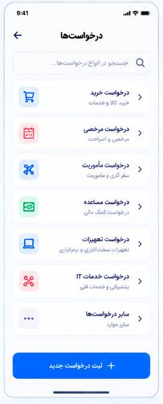

**01-02.jpg** — Request types list / builder step 1 (general info)

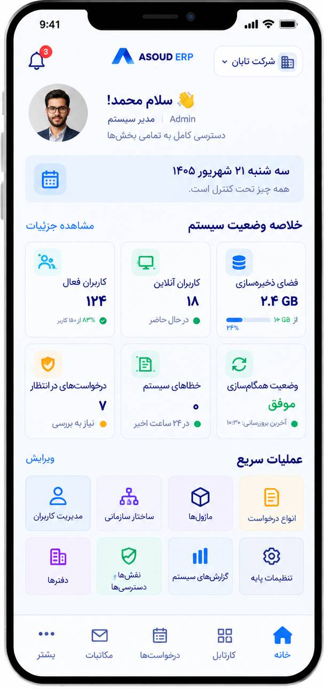

**01-03.jpg** — Builder step 2 (form) and field editor


**01-04.jpg** — Field type sheet


**01-05.jpg** — Field editor


**01-06.jpg** — More builder screens

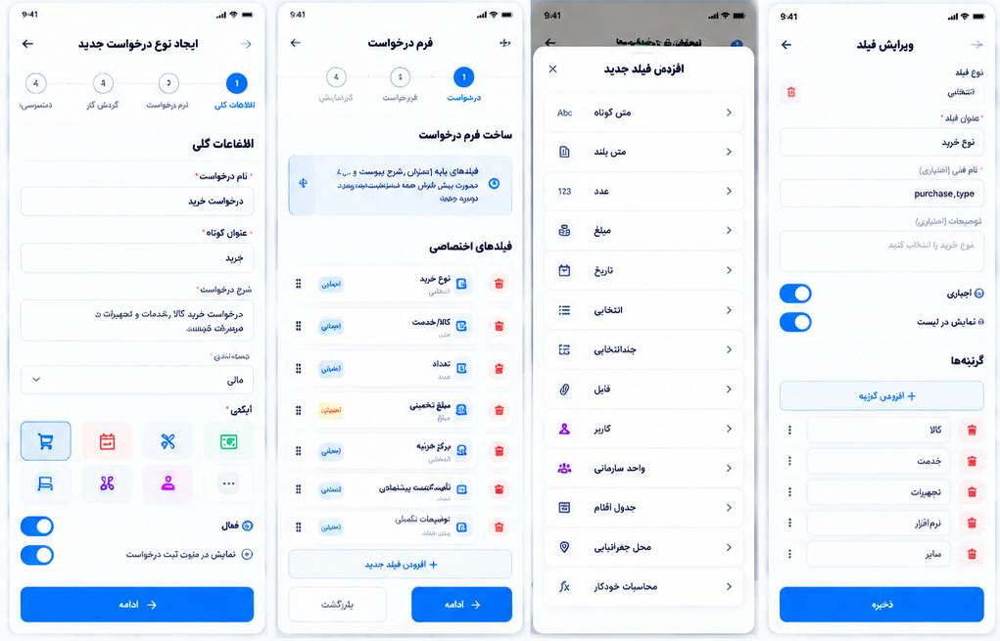

---

## 02 · 2026-09-24

**Request:** Backend: reuse ERPNext modules/functions properly instead of building from scratch.

**Outcome:** Rule kept for all backend work (see skill).

<details><summary>Original prompt (Persian)</summary>

```text
برای بکند هر ویژگی که خواستی و فیچری که خواستی نیاز نیست از صفر پیاده سازی کنی از erpnext ماژول ها و فانکشنایی که نیاز داری رو به صورت درست حسابی و اصلوی اضافه کن به بکند خودمون میتونی از گرافیفای داخلش هم استفاده کنی 
بیا فعلا رو بکند کار کن خودت جدا از ورکرا خودت
```

</details>

---

## 03 · 2026-09-24

**Request:** Bring all planned ERPNext modules into the backend early, organized, with tests and documentation.

**Outcome:** Done in backend v0.10.0/v0.11.0: api/v1 modules + docs/api + integration tests.

<details><summary>Original prompt (Persian)</summary>

```text
اوکی ببین همینطور که میبینی فرانت رو بیشتر مانور دادیم و بکندمون داغونه میخوایم بهم برسن بکند و فرانت و جتی فرا تر هم بره بکنده همه ماژول هایی که قراره اضافه کنیم رو زودتر از erpnext بیار تو بکند پروژه خودمون و درست حاسبی بچینشون و تست بنویس براش تا فرانتمونو هم بهش برسونم داکیومنتشن هم خیلی مهمه 
ادامه بده
گرافیفای دو پروژه هم تکمیل شد
```

</details>

---

## 05 · 2026-09-24

**Request:** Use Codex instead of the local qwen workers.

**Outcome:** Workers policy (see skill workflow).

<details><summary>Original prompt (Persian)</summary>

```text
ببین جای ورکر های لوکالمون از codexاستفاده کن لود روی مدل هامون زیاد شده
```

</details>

---

## 07 · 2026-09-24

**Request:** Do the remaining modules (payroll, POS); were the frontend changes done?

**Outcome:** Done: payroll, POS, projects, reports, support in backend.

<details><summary>Original prompt (Persian)</summary>

```text
فعلا برو سراغ ماژول های باقی مونده
فرانت تغییراتی که گفتم رو دادی؟
```

</details>

---

## 08 · 2026-09-24

**Request:** Complete the four new request field types in the app (multi choice, user, department, item table).

**Outcome:** Done in app v0.20.0.

<details><summary>Original prompt (Persian)</summary>

```text
کاری که فقط سمت اپ مانده: چهار نوع فیلد جدید فرم درخواست (چندانتخابی، کاربر، واحد سازمانی، جدول اقلام) در بک‌اند آماده‌اند، ولی اپ هنوز آن‌ها را «به‌زودی» نشان می‌دهد.
اینا رو هم تکمیل کن در فرانتش
```

</details>

---

## 09 · 2026-09-25

**Request:** Push both repos to a branch separate from main and publish a test release.

**Outcome:** Done: v0.20.0 / v0.10.0 pre-releases.

<details><summary>Original prompt (Persian)</summary>

```text
ادمه بدده و بعدش اوکی جفتشو پوش کن در گیتهاب در یک برنچ جدا از main و ریلیز جدید رو بده بیرون تست کنیمg`1b2
```

</details>

---

## 10 · 2026-09-25

**Request:** Personnel file per employee (fix/complete per design) and the employee's own panel via the Home icon.

**Outcome:** Done in app v0.21.0 + backend v0.11.0 (personnel_file API, EmployeeShell).

<details><summary>Original prompt (Persian)</summary>

```text
بعد از تکمیل اطلاعات پرسنل در HR یک پرونده برای هر پرسنل ایجاد میشه الان هم وجود داره نیاز به اصلاح و تکمیل داره
وقتی اینها انجام بشه با ایکن خانه برای هر شخص در پنل خودش  اینطور میتونه ببینه
```

</details>

**10-01.jpg** — Employee home + «اطلاعات من»

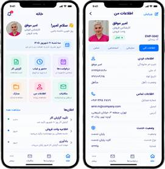

**10-02.jpg** — Personnel file screens (records, documents, contracts, salary)

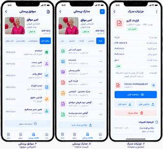

**10-03.jpg** — Personnel file sections

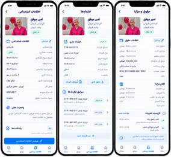

**10-04.jpg** — Personnel information pages

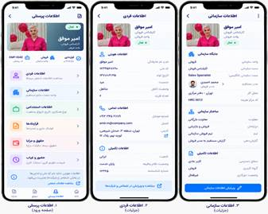

**10-05.jpg** — Personnel file detail designs

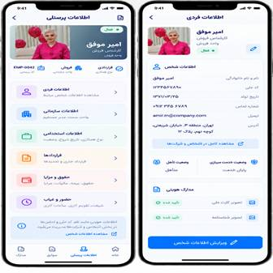

**10-06.jpg** — Annotated fixes

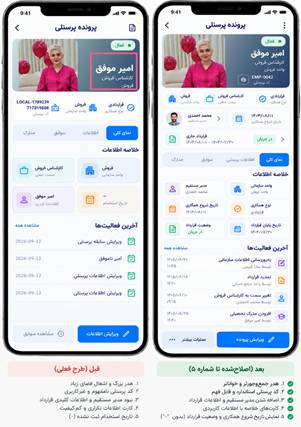

---

## 13 · 2026-09-25

**Request:** What features do we have for the final version / MVP?

**Outcome:** Answered — see README «Remaining work».

<details><summary>Original prompt (Persian)</summary>

```text
برای ورژن  و mvp نهایی چه فیچر هایی داریم لیستشو بگو
```

</details>

---

## 14 · 2026-09-25

**Request:** Personnel file does not open in HR (network error); builder step 3 should be replaced by a preview of the built form; Codex as worker.

**Outcome:** Done in v0.22.0: personnel file offline fallback; builder step 3 = «پیش‌نمایش».

<details><summary>Original prompt (Persian)</summary>

```text
پرونده پرسنلی توی اچ ار باز نمیشهوقتی اینها انجام بشه با ایکن خانه برای هر شخص در پنل خودش  اینطور میتونه ببیدر ادامه درخواستنه
مرحله سوم این صفحه حذف بشه و به جاش  نمایش فرم ساخته شده
 در مرحله قبل نمایش بده
از کدکس به عنوان ورکر استفاده کن خودت صرفا ریویو کن و پرامپت بده بهش
```

</details>

**14-01.png** — Employee home (reference)


**14-02.png** — «اطلاعات من» (reference)


**14-03.png** — Bug: personnel file shows «ارتباط با سرور برقرار نشد»

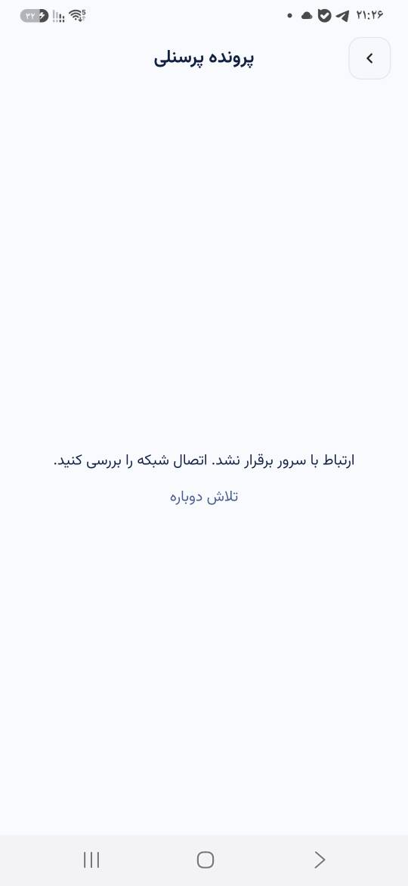

**14-04.png** — Bug (same)


**14-05.png** — Old builder step 3 «گردش کار» to remove

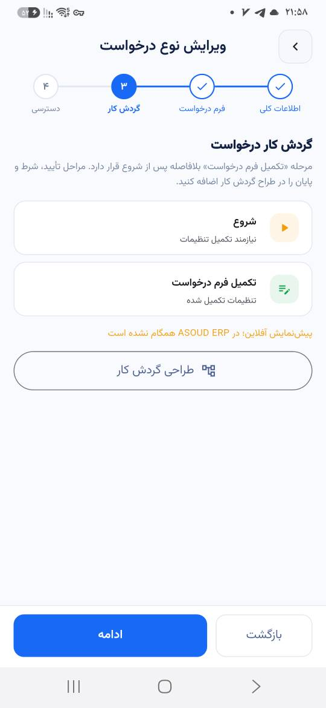

---

## 15 · 2026-09-25

**Request:** Big workflow/request batch (see the prompt).

**Outcome:** Done in app v0.22.0 + backend v0.12.0 (see README). Interpretations to confirm with the user: the ⋮ menu was put on the request DETAILS page (not on the form); home «منابع انسانی» → «ایجاد سند» (the settings HR card is unchanged); stage settings open by tapping a stage (not right after adding it).

<details><summary>Original prompt (Persian)</summary>

```text
توی منوی سه نقطه فرم درخواست هم همین رو نشون میده
دکمه ثبت درخوات توی صفحه اول وصل بهشه به این صفحات
دکمه منابع انسانی بشه  ایجاد سند و این عکسها ساخته بشه
توی صفحه مدیریت دکمه اشخاص و شرکتها رو بکن گردش کار و با زدنش این دکمه باز بشه این فرم باز میشه
بعد از پر شدن فرم این صفحه
وقتی دکمه وظیفه کاربر میزنیم  این صفحات رو داریم
وقتی تایید رد میزنیم این صفحه باز بشه
دکمه اقدام خودکار
```

</details>

**15-01.jpg** — «تأیید / رد» stage settings + role picker + org-unit picker + sub-unit

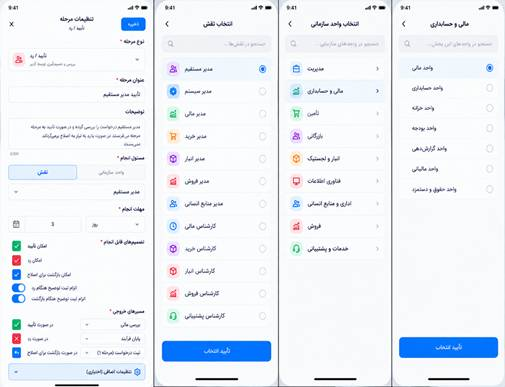

**15-02.jpg** — «وظیفه کاربر» stage settings + org unit with members

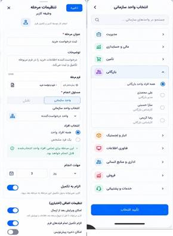

**15-03.jpg** — Designer «افزودن مرحله» sheet (current app)

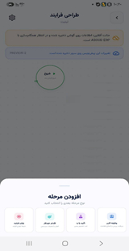

**15-04.jpg** — «ایجاد گردش‌کار» form (current app)

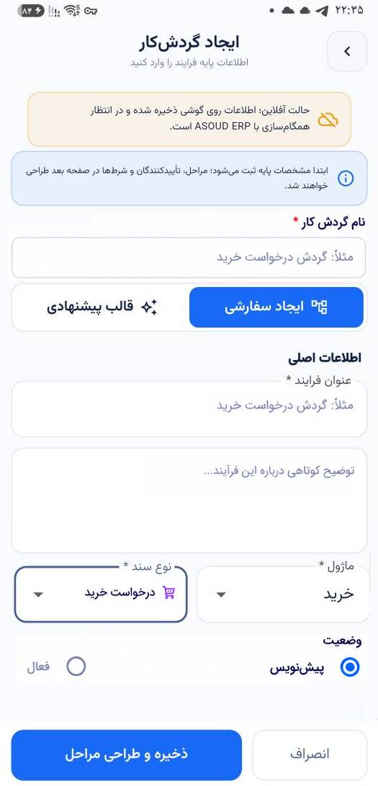

**15-05.jpg** — Document templates: list → wizard (9 screens)

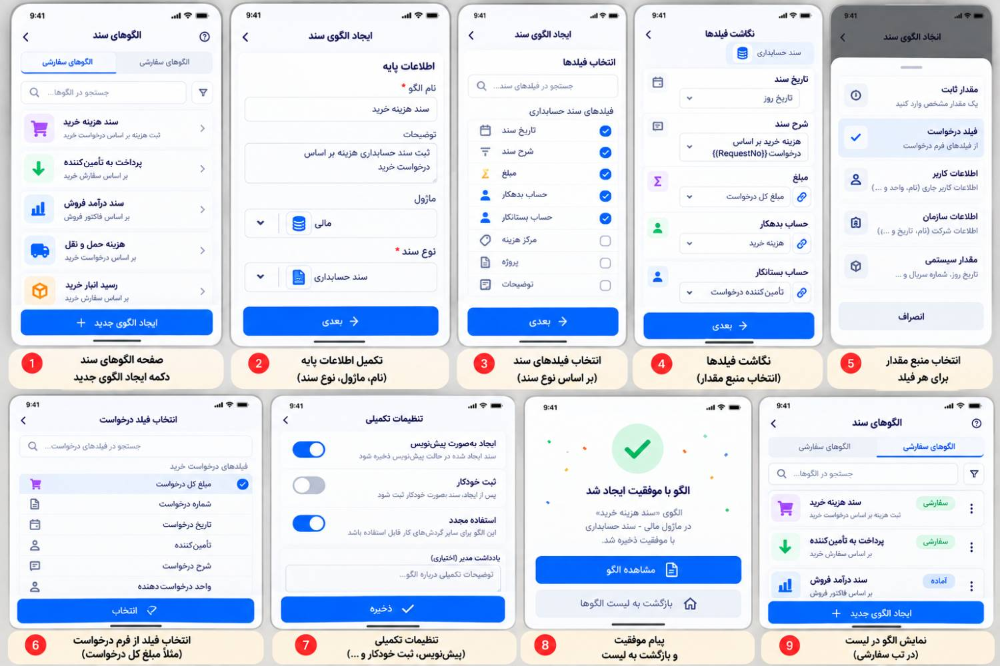

**15-06.jpg** — Automatic action «ایجاد سند» settings flow (5 screens)

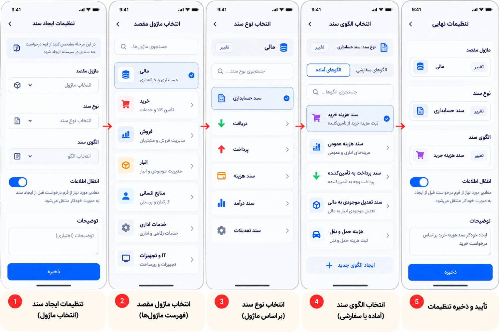

**15-07.jpg** — Request flow: form → success → details → ⋮ menu → print

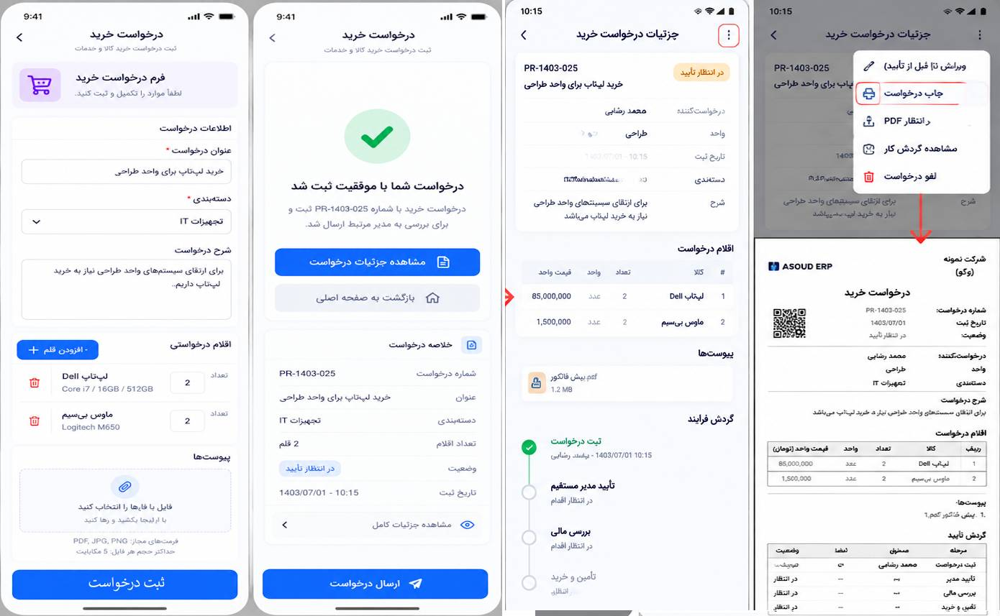

**15-08.jpg** — Empty request form

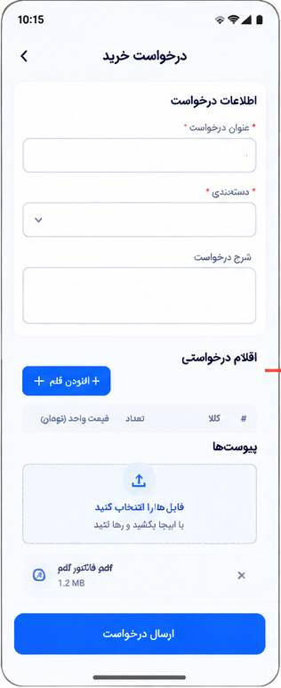

**15-09.jpg** — Old builder step 3 (current app)


**15-10.jpg** — «اقدام خودکار» stage settings (create document, exit routes)

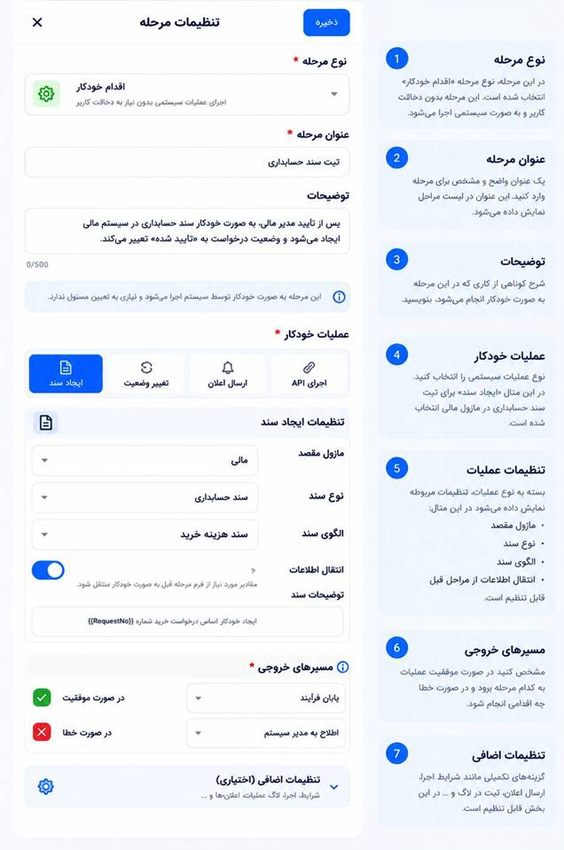

---

## 17 · 2026-09-26

**Request:** Publish the release.

**Outcome:** Done: v0.22.0 / v0.12.0.

<details><summary>Original prompt (Persian)</summary>

```text
پابلیش کن
```

</details>

---

## 20 · 2026-09-26

**Request:** Are there two branches to merge? Some things seem not done in the app.

**Outcome:** Explained repos/branches; the new features needed backend v0.12.0 and did not work in the offline preview yet.

<details><summary>Original prompt (Persian)</summary>

```text
الان دوتا برنچ جدا ساختی که باید مرج شن؟ اخه حس میکنم اینکارایی که گفتی طبق بررسی هام روی اپلیکشین یه سریش انجام نشده بود
```

</details>

---

## 21 · 2026-09-26

**Request:** Where is «ایجاد سند»?

**Outcome:** Home tab → «عملیات سریع» (replaces «منابع انسانی»); managers with an office only.

<details><summary>Original prompt (Persian)</summary>

```text
ایجاد سند  کجاست؟
من گشتم پیداش نکردم
```

</details>

---

## 22 · 2026-09-26

**Request:** While the server is down, save on the phone so outputs can be seen; apply in a new release and merge to main.

**Outcome:** Done in v0.23.0 (offline preview stores templates, stage routes and requests; print/PDF). PRs #16 (app, squash) and #12 (backend) merged by the user.

<details><summary>Original prompt (Persian)</summary>

```text
خب یه چیزی میخواستم تا الان که سرورمون قطه تو گوشی فعلا ذخیره شه بتونیم خروجی هارو ببینیم میشه رو ریلیز جدید اینو اعمال کنی و اینکه رو MAIN مرج کنی بره تغییراتمون؟
```

</details>

---

## 26 · 2026-10-04

**Request:** Create a skill for this project.

**Outcome:** Done: skill/asoud-erp-expert (copy in this folder).

<details><summary>Original prompt (Persian)</summary>

```text
skill مربوط به این پروژه رو بساز
```

</details>

---

## 27 · 2026-10-04

**Request:** Put everything so far on a separate branch + a «prompts and images» folder so Claude can continue.

**Outcome:** This folder (branch docs/claude-handoff).

<details><summary>Original prompt (Persian)</summary>

```text
ببین تا اینجا رو میتونی رو یه برنچ جدا + یه پوشه به نام پرامپت ها و تصاویر بذاری که بقیشو کلودی انجام بدم داشته باشم تو ریپو؟
```

</details>
